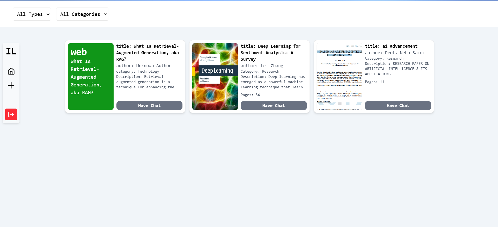

# AI-Powered Digital Library

An AI-based digital library that leverages advanced AI, RAG (Retrieval-Augmented Generation), and similarity search concepts to enable users to upload documents (PDFs and websites) and interact with AI-driven insights. The application generates summaries and embeddings, making documents easily searchable and interactive.

## Features
- Upload and embed PDFs and websites.
- Automatic summary generation and storage.
- Search for similar content using embeddings.
- AI-powered responses and insights from documents.
- User authentication for secure access.
- Cloud-based storage for documents and embeddings.
- Planned: Rate limiting for enhanced performance.

## Tech Stack
- **Frontend:** React (Client)
- **Backend:** Node.js, Express (Server)
- **Database:** MongoDB (Atlas)
- **Vector Store:** Upstash
- **File Storage:** Cloudinary
- **Embeddings:** Geko
- **AI and RAG:** LangChain, Gemini API
- **Monorepo:** Custom monorepo setup

## Project Structure
```
vinitngr-iolib/
├── client/          # Frontend (React, Vite)
├── server/          # Backend (Node.js, Express, TypeScript)
├── practice-js/     # JS practice and RAG experiments
├── README.md
├── package.json
└── structure.txt

```

## Installation
1. Clone the repository. 
```bash 
    git clone https://github.com/vinitngr/IOLIB.git
```
2. Install dependencies for both client and server:
   ```bash
   npm install
   cd client && npm install
   cd ../server && npm install
   ```
3. Set up environment variables:
   - MongoDB URI (Atlas)
   - Upstash API Key
   - Gemini API Key
   - Cloudinary Credentials
4. Run the application:
   ```bash
   npm run dev
   ```

## Usage
1. Access the web app at `http://localhost:3000`.
2. Upload a PDF or website link to generate embeddings and summaries.
3. Interact with the documents via AI-driven responses and similarity search.

## Screenshots
### Home Page


### Chat Area

1. Access the web app at `http://localhost:3000`.
2. Upload a PDF or website link to generate embeddings and summaries.
3. Interact with the documents via AI-driven responses and similarity search.

## Potential Future Improvements
- Consider implementing rate limiting to manage high query volumes.
- Explore enhancing error handling and user feedback during file upload and processing.
- Evaluate the introduction of caching mechanisms to optimize frequent queries.
- Integrate Optical Character Recognition (OCR) to enable text extraction from scanned documents and images.

## Contributing
Feel free to open issues and contribute by submitting pull requests.
